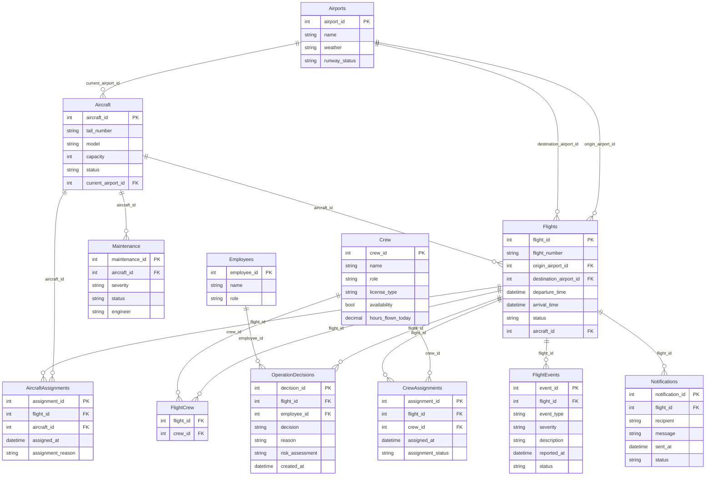

# Blue Horizon Airlines — Flight Operations MCP Server

## The Company

Blue Horizon Airlines is a mid-size international carrier connecting Cairo,
Dubai, London, and Paris. Flight Operations Control monitors every active
flight and has to react in real time to weather, mechanical, and crew-duty
disruptions.

## The Problem

Before this project, disruption handling meant a controller manually
cross-referencing aircraft status, crew duty hours, and maintenance records
across separate screens, then hand-typing an update — with no consistent
record of who approved what, or why. As soon as anyone considered letting an
LLM assist with this workflow, the naive version — an assistant with direct
database access — became a real liability:

- An assistant could cancel a flight or reassign an aircraft with no human
  sign-off, based only on its own read of a chat message.
- Nothing would stop it from assigning a crew member already past their duty
  limit, or an aircraft still in maintenance.
- There would be no audit trail distinguishing an employee's decision from
  the assistant's own inference.

The fix isn't "don't use an LLM here" — it's giving it **scoped, mediated
access**: a real authorization layer, a pause for human confirmation on the
highest-stakes action (cancelling a flight), and a visible boundary between
what any session can do versus what an authenticated Operations Manager
session can do.

## Database & ERD

Engine: SQLite (see `db/schema.sql`, `db/seed.sql`).



`AircraftAssignments`, `CrewAssignments`, `FlightEvents`, `OperationDecisions`,
and `Notifications` form the audit trail — every write tool leaves a record
of what changed, who authorized it, and (for operational decisions) an
independent risk read generated via sampling.

## How Each Protocol Concern Shows Up

| Concern | Where | What it actually does |
|---|---|---|
| **Capability negotiation** | `mcp_app.py`, tool/resource/prompt registration in `tools.py`/`resources.py`/`prompts.py` | Server capabilities (tools, resources, prompts) are declared implicitly via FastMCP registration. Sampling and elicitation are *client*-declared capabilities; `create_operation_decision` and `cancel_flight` wrap their `ctx.session.create_message` / `ctx.elicit` calls in error handling so a client that didn't declare the capability gets a clear error instead of a hang or crash. |
| **Notifications** | `notifications.py` (`SessionState`, `authenticate_manager`, `notify_tools_changed`) | A session starts unable to use write tools (`assign_aircraft`, `assign_backup_crew`, `reschedule_flight`, `cancel_flight`, `complete_maintenance` all check `SessionState.is_manager_authenticated()`). Calling `authenticate_manager` with a valid Operations Manager `employee_id` flips that state and pushes a real `notifications/tools/list_changed` message. |
| **Elicitation** | `elicitation.py` (`confirm_cancel_flight`), wired into `cancel_flight` in `tools.py` | Cancelling a flight is the highest-stakes write tool — it directly affects passengers — so after authorization passes, `cancel_flight` calls `elicitation/create` via `ctx.elicit(...)` and will not commit the cancellation unless the human explicitly confirms. |
| **Sampling** | `create_operation_decision` in `tools.py` | Before saving an operational decision, the tool calls `sampling/createMessage` via `ctx.session.create_message(...)` to get the *client's* model to generate a short independent risk assessment, stored alongside the decision in `OperationDecisions.risk_assessment`. |
| **Resources** | `resources.py` | Three static policy documents (`policy://flight-delay`, `policy://crew-duty`, `policy://maintenance`) are exposed as true resources — fetched once and reasoned over, not re-executed as a tool call. Live reference data (flight status, weather, available aircraft/crew, maintenance reports) is also resource-based since it's read-only. |
| **Prompts** | `prompts.py` | Three parameterized templates (`delay_announcement`, `operations_report`, `maintenance_summary`) give the host reusable, canned starting points instead of every client re-writing the same prompt. |
| **Transport (both)** | `server.py` | Starts on stdio during development; `python server.py http` switches to Streamable HTTP on `0.0.0.0:8000`. Commit history shows the stdio-first, HTTP-added-later progression. |
| **Progress tracking** | `generate_operations_report` in `tools.py` | Pulls aircraft, crew, and destination weather for every active flight — several DB round-trips per flight — and calls `ctx.report_progress(...)` after each one instead of blocking silently until the whole report is built. |
| **Defensive tool design** | `cancel_flight` in `tools.py` | Real JSON Schema constraints on inputs (typed fields, `required`, `additionalProperties: false` — see tool registration), independent server-side validation of flight/employee state beyond what the schema can express, and a handler-level authorization check (`employee["role"] != "Operations Manager"`) that runs regardless of what the schema alone would allow through. |

## Transport Choice, Justified

Blue Horizon operates as a single connected operations system rather than
fully independent per-location deployments, so the long-term target is
Streamable HTTP behind auth — multiple controllers across shifts and
locations need to reach the same live server state (crew availability,
aircraft status) rather than each running an isolated stdio instance.
Development and the graded demo run over stdio for simplicity and easier
debugging; `server.py` supports both via a transport argument, and the
commit history shows stdio first, HTTP added once the tool surface
stabilized.

## Comparison Note

**Read-only (resource-backed):** flight status, flight details, airport
weather, available aircraft, available crew, maintenance reports, delayed
flights, today's flights, and the three policy documents.

**Write (tool-backed):** `assign_aircraft`, `assign_backup_crew`,
`reschedule_flight`, `cancel_flight`, `complete_maintenance`,
`create_operation_decision`, `send_notification`, `resolve_operational_issue`,
`authenticate_manager`.

**Requires elicitation:** `cancel_flight` only. It's the one write action
with irreversible, passenger-facing consequences — the other write tools
have DB-level state guards (status checks, duty-hour limits, duplicate-
assignment checks) but don't pause for a human because their effects are
either easily reversible (a reassignment can be reassigned again) or already
gated by role-based authorization.

**Session gating vs. per-call authorization — two different things, both
present:** every state-changing tool checks the calling employee's role
against the database on every call (per-call authorization, always active).
Separately, five of those tools additionally check `SessionState` — a
session-level flag only set by calling `authenticate_manager` — before doing
anything. This second layer is what the `tools/list_changed` notification
is describing.

**Known limitation, stated plainly rather than hidden:** whether the FastMCP
version in use actually removes gated tools from `tools/list` for an
unauthenticated session, or only makes calling them fail with a clear error
while they remain listed, depends on the installed SDK version and hasn't
been fully verified against it. Either way, the *notification* fires
honestly (a real state transition just occurred) and the *behavior* changes
correctly on the next call — but a grader should not expect a shrunken tool
list from an unauthenticated session unless the installed FastMCP version is
confirmed to support dynamic tool enable/disable.

**If a client connects without elicitation support:** `cancel_flight`
catches the failure and returns an error explaining that cancellation
requires elicitation, rather than hanging indefinitely. `create_operation_decision`
degrades similarly if sampling isn't supported — it records
`"(risk assessment unavailable: ...)"` and still saves the decision, rather
than blocking the whole write on an optional capability.

## Long-Context Management & Evaluation

The Blue Horizon Airlines Operations Agent includes a Context Manager for handling long conversation histories efficiently.

### Supported Strategies

The Context Manager implements four strategies:

1. **Sliding Window**
2. **Observation and Tool-Output Masking**
3. **Recursive Summarization**
4. **Zone-Based Pruning**

### Evaluation

Four long-context airline scenarios were used:

- Weather Delay
- Maintenance Issue
- Crew Reassignment
- Flight Cancellation

Each scenario contains important operational information followed by routine tool-output noise.

The strategies were evaluated using:

- **Accuracy** – preservation of expected operational information.
- **Tokens** – estimated size of the resulting context.
- **Latency** – time required to apply the strategy.

### Results

| Strategy | Avg Accuracy | Avg Tokens | Avg Latency (ms) |
|---|---:|---:|---:|
| Sliding Window | 0.625 | 623.2 | 0.002 |
| Observation Masking | 1.000 | 609.5 | 0.089 |
| Recursive Summarization | 1.000 | 384.0 | 0.336 |
| Zone-Based Pruning | 1.000 | 3630.0 | 0.143 |

### Best Strategy

**Observation Masking** was selected as the best overall strategy.

It achieved **100% average accuracy** while maintaining relatively low token usage and low latency.

Recursive Summarization achieved the lowest token usage at 384 average tokens, but had higher latency.

### Testing

The Context Manager is covered by automated tests for:

- Sliding Window
- Observation Masking
- Tool-Output Masking
- Recursive Summarization
- Zone-Based Pruning
- Strategy Selection
- Invalid Strategy Handling
- Parameter Validation
- Message Validation

Test command:

```bash
python tests/test_context.py
# or, with pytest installed:
pytest tests/test_context.py -v
```

---

# Memory & RAG Lab

This section extends the same server, database, and repo above. It is not a
new project — `mcp_server/` and `db/` are untouched by this lab; `agent/`
and `mcp_server/` only gain the wiring needed to use the new `memory/` and
`rag/` systems.

## The Memory & Knowledge Problem

Two gaps show up once Blue Horizon's Operations Control actually starts
relying on the assistant from the MCP Server Lab:

1. **Nothing survives past a session.** A dispatcher working a weather
   disruption tells the assistant about a maintenance hold on `BH218` at
   the start of a shift; an hour later, after dozens of unrelated tool
   calls, a different controller asks about the same flight and the
   assistant has no memory of the earlier context. Operational facts
   (aircraft reassignments, crew swaps, recurring delay causes) get
   re-explained every time, and there's no way to ask "what changed on
   this flight today?" without re-reading the raw event log.
2. **A 40-tool-call-away policy manual nobody wants to turn into 40 more
   tools.** Real dispatch decisions (when a backup aircraft must be
   evaluated, how long a crew reassignment window is, what a diversion
   requires) live in Blue Horizon's operational manual
   (`rag/rag_data/operational_policies.txt`) — not in any database table.
   The database can tell you a flight's *current* status; it can't tell
   you *why* a 61-minute weather delay obligates a Passenger Services
   notification, or what the Flight Duty Period rule actually says.

Getting either of these wrong costs something real: forgetting a
maintenance hold can mean assigning a flight to an aircraft with an open
discrepancy; a hallucinated policy answer (inventing a duty-hour limit
instead of citing the real one) can put a crew member over their legal
Flight Duty Period. That's the bar this lab is held to — every concern
below exists because one of those two failure modes is a real one, not
because the assignment listed it.

## Memory Architecture — `memory/`

| Concern | File | What it does |
|---|---|---|
| Short-term buffer | `short_term.py` | A capped, self-expiring rolling buffer (`ShortTermMemory`) — old items age out on read via `get_all()`, independent of the scratchpad below. |
| Scratchpad | `scratchpad.py` | A plain key/value working-state store (`Scratchpad`), separate from the transcript buffer, so pruning short-term memory never destroys what the agent is actively tracking mid-task. |
| Promote-or-drop routing | `router.py` | `PromoteOrDropRouter.route()` matches content against operational keywords (`flight`, `aircraft`, `crew`, `maintenance`, `delay`, `cancel`, ...) and returns an explicit `action` (`promote`/`drop`) plus a human-readable `reason` and `matched_keywords` — the reasoning a grader (or a teammate) can actually see. It only ever writes to episodic memory, never semantic. |
| Episodic memory | `episodic.py` | `EpisodicMemory.store()` timestamps and appends promoted events. This is the *only* thing the router writes to. |
| Semantic consolidation | `consolidation.py`, `conflict_resolution.py` | `ConsolidationLayer.consolidate()` is a **separate, explicit pass** over the full episodic store — not something the router calls. For each keyed episode, it either creates a new semantic fact or, if one already exists for that key, runs `ConflictResolution.resolve_records()` (last-write-wins by `updated_at`, with the losing record marked `"superseded"` rather than deleted) before writing the new value through `SemanticMemory.store()`. |
| Versioning | `versioning.py` | `MemoryVersioning.save_version()` appends every write for a key rather than overwriting it, so `get_history(key)` returns the full chain — e.g. "BH218 assigned Aircraft A" → "BH218 assigned Aircraft B" both remain visible, with the current one flagged separately. |
| Expiration | `expiration.py` | `MemoryExpiration.is_expired()` checks a record's age against a per-fact TTL (`metadata["ttl_minutes"]`); `SemanticMemory.get_record()` calls it on every read and returns `None` (marking the record `"expired"`) rather than silently serving a stale fact. |
| Orchestration | `manager.py` | `MemoryManager` wires all of the above together. `remember(content, metadata)` only ever touches short-term/episodic memory; `run_consolidation()` is the single, separate entry point allowed to write semantic memory — matching the assignment's explicit rule that consolidation must be a periodic pass the router never triggers directly. |

**A real conflict, resolved:** `remember("BH218 assigned Aircraft A", {"key": "BH218_aircraft"})`
followed later by `remember("BH218 assigned Aircraft B", {"key": "BH218_aircraft"})`
— two episodes that genuinely contradict each other. Calling
`run_consolidation()` after each one shows the fact updating from
Aircraft A to Aircraft B, `semantic.get_history("BH218_aircraft")`
returning both versions (not just the latest), and the earlier record's
`status` flipped to `"superseded"` instead of being dropped. See
`tests/test_memory.py::test_manager_full_flow_with_conflicting_update`.

## Long-Context Management — `agent/context_manager.py`, `evaluation/context_evaluation.py`

Covered above under **Long-Context Management & Evaluation**. Summary of
why Observation Masking shipped: Blue Horizon's real long-context failure
mode is tool-call bloat (each `assign_aircraft`/`check_weather`/etc. call
adds a large JSON blob to history), not dialogue length, and Observation
Masking is the strategy that targets exactly that — mask large tool
outputs, leave short-and-critical ones intact — at a fraction of Zone-Based
Pruning's token cost and without Recursive Summarization's extra LLM
round-trip latency.

## RAG Architecture — `rag/`

| Concern | Where | What it does |
|---|---|---|
| Chunking & embeddings | `rag_pipeline.py: _initialize_pipeline()` | `operational_policies.txt` is loaded and split with `RecursiveCharacterTextSplitter` (400-char chunks, 60-char overlap), then embedded with a local `all-MiniLM-L6-v2` sentence-transformer (`HuggingFaceEmbeddings`) — no per-query API cost for embedding. |
| Vector database | `rag_pipeline.py` (Chroma) | Chunks are indexed into a persisted Chroma collection (`vector_db/`, HNSW-backed ANN index under the hood) rather than a flat Python list — `Chroma.from_documents(...)` on first run, reopened via `persist_directory` afterward so re-indexing doesn't happen on every process start. |
| Naive RAG | `naive_rag()` | Baseline: `vector_store.similarity_search(query, k)`. Good for general questions with no exact identifiers. |
| Hybrid search | `hybrid_search()` | Vector similarity (Chroma) + keyword scoring (`rank_bm25.BM25Okapi`) combined via Reciprocal Rank Fusion. Wins on citation-heavy questions — an identifier like `"4.2b"` doesn't embed distinctively, but BM25 matches it directly. |
| Agentic RAG | `agentic_rag()` | Retrieves via hybrid search, then asks the LLM to critique whether that context is actually sufficient; if not, it re-retrieves with a refined query and merges the results. Handles multi-part questions naive/hybrid retrieval alone can't (e.g. a question spanning both a crew duty-hour limit *and* a maintenance hold). |
| Self-RAG-style verification | `self_rag_verification()` | A post-retrieval, pre-answer check: given the query and the retrieved chunks, the LLM is asked a direct relevant/sufficient yes-or-no before those chunks are allowed to back an answer — applied to every architecture's output in the evaluation, not assumed to be true because a similarity search returned *something*. |

**Known scope gap, stated plainly:** the metadata index for pre/mid-search
filtering (e.g. filter by policy section or last-reviewed date before doing
similarity search) and the Graph RAG bonus are not implemented — the
corpus here is one manual without the strongly relational entity structure
(protocol ↔ drug ↔ condition, etc.) that would make Graph RAG genuinely
the right tool, per the assignment's own guidance not to build it unless
it's genuinely applicable.

## Retrieval Evaluation — `evaluation/eval.py`

Three domain-specific test questions, one per required category:

| # | Question | Category it should favor |
|---|---|---|
| 1 | "What is the standard fasting or reporting window before operational flight duties?" | General — naive vector search |
| 2 | "What does Protocol 4.2b specify regarding severe weather delay protocols?" | Citation-heavy — hybrid (BM25) search |
| 3 | "For a flight facing both a crew duty-hour limit and an aircraft maintenance hold, what steps and approvals are required before it can depart?" | Multi-part / needs decomposition — agentic RAG |

Run it yourself with:

```bash
python evaluation/eval.py
```

This requires `GEMINI_API_KEY` (or `GOOGLE_API_KEY`) to be set in `.env` —
the agentic-RAG critique step and the Self-RAG verification step both call
the LLM. The script prints a live comparison table (accuracy against
`self_rag_verification`, average latency, and average token usage measured
from what was actually sent/retrieved on each call — not a fixed number).

> **Table intentionally left for you to paste in:** an earlier version of
> this script had the token column hardcoded to placeholder values instead
> of measuring them — that's been fixed (see Bug Fix Log below), but it
> means the real numbers now genuinely depend on the API key and network
> access available when you run it. Paste your actual output here before
> submitting:
>
> | Architecture | Accuracy | Avg Latency (s) | Avg Tokens |
> |---|---|---|---|
> | Naive RAG | | | |
> | Hybrid Search | | | |
> | Agentic RAG | | | |

## Setup & Run Instructions

```bash
# 1. Install dependencies
pip install -r requirements.txt

# 2. Configure secrets — never commit this file (see .gitignore)
cp .env.example .env   # then fill in GEMINI_API_KEY
echo "GEMINI_API_KEY=your-key-here" >> .env

# 3. Initialize the database (safe to re-run; skips init if already seeded)
python mcp_server/database.py

# 4. Run the MCP server + demo client
python mcp_server/server.py            # stdio, in one terminal
python agent/client.py                 # in another terminal
# or, over HTTP:
python mcp_server/server.py http
python agent/client.py http

# 5. Run the test suites
python tests/test_memory.py
python tests/test_context.py
python tests/test_client.py            # requires a working `mcp` install

# 6. Run the evaluations (produce the comparison tables above)
python evaluation/context_evaluation.py
python evaluation/eval.py              # requires GEMINI_API_KEY + network
```

## Project Structure

```
Blue-Horizon-Airlines-A/
├── db/                    # schema.sql, seed.sql — unchanged from the MCP Server Lab
├── mcp_server/            # tools, resources, prompts, elicitation, notifications, auth
├── agent/                 # client.py (MCP demo client), context_manager.py
├── memory/                # short-term, scratchpad, episodic, semantic, router, consolidation
├── rag/                   # rag_pipeline.py, rag_data/operational_policies.txt, vector_db/
├── evaluation/            # context_evaluation.py, eval.py — produce the tables above
├── tests/                 # test_memory.py, test_context.py, test_client.py
└── README.md
```

## Bug Fix Log

Kept here for transparency rather than squashed out of history — issues
found and fixed after the initial memory/RAG implementation:

- **Broken imports** in `tests/test_context.py` and
  `evaluation/context_evaluation.py` — both pointed `sys.path` at the
  project root instead of `agent/`, where `context_manager.py` actually
  lives, so neither could import it at all.
- **`agent/client.py`** launched the server via a path
  (`agent/mcp_server/server.py`) that never existed — `mcp_server/` is a
  sibling of `agent/`, not nested inside it.
- **Fabricated evaluation numbers** — `evaluation/eval.py`'s token column
  was hardcoded to placeholder values instead of being measured; also
  missing the required decomposition-style test question.
- **`deauthenticate_manager`** was fully implemented but never registered
  as an `@mcp.tool()`, so a manager could authenticate but never log out.
- **Consolidation ran at write time** — `MemoryManager.remember()` called
  `consolidation.consolidate()` on every promoted event, violating the
  requirement that consolidation be a separate, periodic pass the
  promote-or-drop router never triggers directly. Split into `remember()`
  (episodic-only) and a separate `run_consolidation()`.
- **No `.gitignore`** — `.env` (holding a live API key) was untracked but
  completely unprotected against an accidental `git add .`.
- `tests/test_memory.py` and `tests/test_client.py` existed as empty
  (0-byte) files with no actual tests.

## Team Ownership

| Owner | Existing-system fixes | New work |
|---|---|---|
| Person 1 | `db/` — schema, seed data, connection wiring, CRUD/query fixes | `memory/` — short-term memory, scratchpad, promote-or-drop router, episodic memory, semantic memory, consolidation layer, conflict resolution, versioning, expiration |
| Person 2 | `mcp_server/` — tools, validation, error handling, capability negotiation | `evaluation/context_evaluation.py`, `agent/context_manager.py` — all four context strategies, long-context test suite, accuracy/token/latency comparison table |
| Person 3 | `agent/` — client/server connection, run instructions, integration fixes | `rag/` — chunking, embeddings, vector store, naive/hybrid/agentic RAG, Self-RAG verification, `evaluation/eval.py`; final integration of `memory/` and `rag/` into the live agent loop, end-to-end demo |

