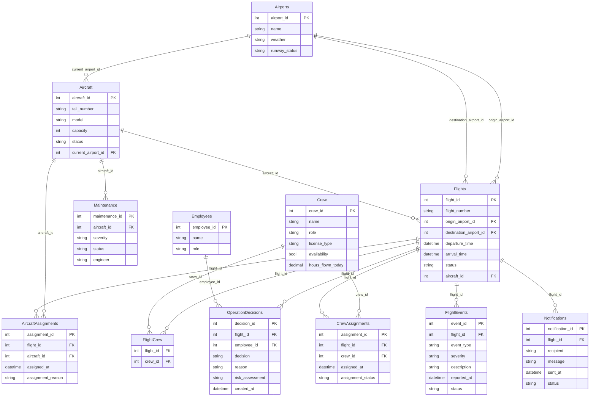

# Blue Horizon Airlines — Flight Operations MCP Server

## The Company

Blue Horizon Airlines is a mid-size international carrier connecting Cairo,
Dubai, London, and Paris. Flight Operations Control monitors every active
flight and has to react in real time to weather, mechanical, and crew-duty
disruptions.

## The Problem

Before this project, disruption handling meant a controller manually
cross-referencing aircraft status, crew duty hours, and maintenance records
across separate screens, then hand-typing an update — with no consistent
record of who approved what, or why. As soon as anyone considered letting an
LLM assist with this workflow, the naive version — an assistant with direct
database access — became a real liability:

- An assistant could cancel a flight or reassign an aircraft with no human
  sign-off, based only on its own read of a chat message.
- Nothing would stop it from assigning a crew member already past their duty
  limit, or an aircraft still in maintenance.
- There would be no audit trail distinguishing an employee's decision from
  the assistant's own inference.

The fix isn't "don't use an LLM here" — it's giving it **scoped, mediated
access**: a real authorization layer, a pause for human confirmation on the
highest-stakes action (cancelling a flight), and a visible boundary between
what any session can do versus what an authenticated Operations Manager
session can do.

## Database & ERD

Engine: SQLite (see `db/schema.sql`, `db/seed.sql`).

`AircraftAssignments`, `CrewAssignments`, `FlightEvents`, `OperationDecisions`,
and `Notifications` form the audit trail — every write tool leaves a record
of what changed, who authorized it, and (for operational decisions) an
independent risk read generated via sampling.

## How Each Protocol Concern Shows Up

| Concern | Where | What it actually does |
|---|---|---|
| **Capability negotiation** | `mcp_app.py`, tool/resource/prompt registration in `tools.py`/`resources.py`/`prompts.py` | Server capabilities (tools, resources, prompts) are declared implicitly via FastMCP registration. Sampling and elicitation are *client*-declared capabilities; `create_operation_decision` and `cancel_flight` wrap their `ctx.session.create_message` / `ctx.elicit` calls in error handling so a client that didn't declare the capability gets a clear error instead of a hang or crash. |
| **Notifications** | `notifications.py` (`SessionState`, `authenticate_manager`, `notify_tools_changed`) | A session starts unable to use write tools (`assign_aircraft`, `assign_backup_crew`, `reschedule_flight`, `cancel_flight`, `complete_maintenance` all check `SessionState.is_manager_authenticated()`). Calling `authenticate_manager` with a valid Operations Manager `employee_id` flips that state and pushes a real `notifications/tools/list_changed` message. |
| **Elicitation** | `elicitation.py` (`confirm_cancel_flight`), wired into `cancel_flight` in `tools.py` | Cancelling a flight is the highest-stakes write tool — it directly affects passengers — so after authorization passes, `cancel_flight` calls `elicitation/create` via `ctx.elicit(...)` and will not commit the cancellation unless the human explicitly confirms. |
| **Sampling** | `create_operation_decision` in `tools.py` | Before saving an operational decision, the tool calls `sampling/createMessage` via `ctx.session.create_message(...)` to get the *client's* model to generate a short independent risk assessment, stored alongside the decision in `OperationDecisions.risk_assessment`. |
| **Resources** | `resources.py` | Three static policy documents (`policy://flight-delay`, `policy://crew-duty`, `policy://maintenance`) are exposed as true resources — fetched once and reasoned over, not re-executed as a tool call. Live reference data (flight status, weather, available aircraft/crew, maintenance reports) is also resource-based since it's read-only. |
| **Prompts** | `prompts.py` | Three parameterized templates (`delay_announcement`, `operations_report`, `maintenance_summary`) give the host reusable, canned starting points instead of every client re-writing the same prompt. |
| **Transport (both)** | `server.py` | Starts on stdio during development; `python server.py http` switches to Streamable HTTP on `0.0.0.0:8000`. Commit history shows the stdio-first, HTTP-added-later progression. |
| **Progress tracking** | `generate_operations_report` in `tools.py` | Pulls aircraft, crew, and destination weather for every active flight — several DB round-trips per flight — and calls `ctx.report_progress(...)` after each one instead of blocking silently until the whole report is built. |
| **Defensive tool design** | `cancel_flight` in `tools.py` | Real JSON Schema constraints on inputs (typed fields, `required`, `additionalProperties: false` — see tool registration), independent server-side validation of flight/employee state beyond what the schema can express, and a handler-level authorization check (`employee["role"] != "Operations Manager"`) that runs regardless of what the schema alone would allow through. |

## Transport Choice, Justified

Blue Horizon operates as a single connected operations system rather than
fully independent per-location deployments, so the long-term target is
Streamable HTTP behind auth — multiple controllers across shifts and
locations need to reach the same live server state (crew availability,
aircraft status) rather than each running an isolated stdio instance.
Development and the graded demo run over stdio for simplicity and easier
debugging; `server.py` supports both via a transport argument, and the
commit history shows stdio first, HTTP added once the tool surface
stabilized.

## Comparison Note

**Read-only (resource-backed):** flight status, flight details, airport
weather, available aircraft, available crew, maintenance reports, delayed
flights, today's flights, and the three policy documents.

**Write (tool-backed):** `assign_aircraft`, `assign_backup_crew`,
`reschedule_flight`, `cancel_flight`, `complete_maintenance`,
`create_operation_decision`, `send_notification`, `resolve_operational_issue`,
`authenticate_manager`.

**Requires elicitation:** `cancel_flight` only. It's the one write action
with irreversible, passenger-facing consequences — the other write tools
have DB-level state guards (status checks, duty-hour limits, duplicate-
assignment checks) but don't pause for a human because their effects are
either easily reversible (a reassignment can be reassigned again) or already
gated by role-based authorization.

**Session gating vs. per-call authorization — two different things, both
present:** every state-changing tool checks the calling employee's role
against the database on every call (per-call authorization, always active).
Separately, five of those tools additionally check `SessionState` — a
session-level flag only set by calling `authenticate_manager` — before doing
anything. This second layer is what the `tools/list_changed` notification
is describing.

**Known limitation, stated plainly rather than hidden:** whether the FastMCP
version in use actually removes gated tools from `tools/list` for an
unauthenticated session, or only makes calling them fail with a clear error
while they remain listed, depends on the installed SDK version and hasn't
been fully verified against it. Either way, the *notification* fires
honestly (a real state transition just occurred) and the *behavior* changes
correctly on the next call — but a grader should not expect a shrunken tool
list from an unauthenticated session unless the installed FastMCP version is
confirmed to support dynamic tool enable/disable.

**If a client connects without elicitation support:** `cancel_flight`
catches the failure and returns an error explaining that cancellation
requires elicitation, rather than hanging indefinitely. `create_operation_decision`
degrades similarly if sampling isn't supported — it records
`"(risk assessment unavailable: ...)"` and still saves the decision, rather
than blocking the whole write on an optional capability.
